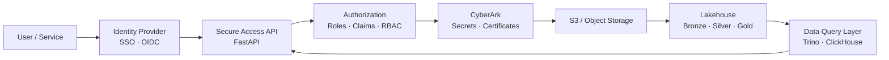
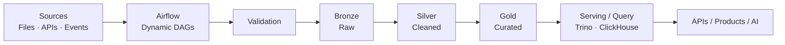
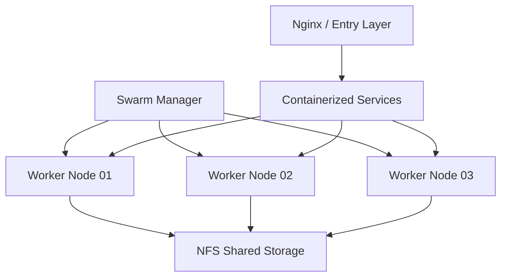

<!--
  Kousha Rezaei — GitHub Profile README
  Profile repository: Koi725/Koi725

  banner.svg is intentionally kept beside this README.
  External image services are limited to shields.io.
-->

<p align="center">
  
</p>

<br />

<h1 align="center">Platform & Data Engineer</h1>

<p align="center">
  <strong>I build secure data platforms and pipelines end to end.</strong>
</p>

<p align="center">
  Identity & access → ingestion → orchestration → storage → transformation → query → services → deployment
</p>

<p align="center">
  <a href="https://kousharezaei.dev">
    
  </a>
  <a href="https://github.com/Koi725">
    
  </a>
  
</p>

<p align="center">
  
  
  
  
</p>

---

## `> what_i_do`

My main work is at the intersection of **data engineering, platform engineering, backend systems, infrastructure, and security**.

I build services that control how users and applications reach data:

- **SSO / OIDC authentication flows**
- **Role-based access control**
- **CyberArk-backed certificate and secrets retrieval**
- **Secure S3 data access and querying**
- **FastAPI service layers**
- **Containerized deployments**
- **Dockerfiles, YAML configuration, and deployment automation**

I build the pipelines behind those services:

- **Apache Airflow orchestration**
- **Dynamic DAG generation**
- **Mounted-folder ingestion**
- **Validation and controlled processing**
- **S3-compatible data sinks**
- **Bronze → Silver → Gold medallion flows**
- **Data-lineage migration across frameworks**

And I build the infrastructure underneath them:

- **High-availability Docker Swarm clusters**
- **Manager and worker node topology**
- **NFS shared storage**
- **Container scheduling and failover**
- **Linux-based deployment environments**
- **Reverse-proxied application infrastructure**

The objective is straightforward:

> **Move data reliably, expose it securely, and make the entire system deployable and operable.**

---

## `> engineering_scope`

```text
┌────────────────────────────────────────────────────────────────────────────┐
│                              DATA SOURCES                                  │
│                                                                            │
│        Files             APIs             Events             Databases     │
└───────────┬────────────────┬────────────────┬────────────────────┬──────────┘
            │                │                │                    │
            └────────────────┴───────┬────────┴────────────────────┘
                                     │
                                     ▼
┌────────────────────────────────────────────────────────────────────────────┐
│                         INGESTION & ORCHESTRATION                          │
│                                                                            │
│         Airflow · Dynamic DAGs · Validation · Batch · Kafka               │
└────────────────────────────────────┬───────────────────────────────────────┘
                                     │
                                     ▼
┌────────────────────────────────────────────────────────────────────────────┐
│                            DATA PLATFORM                                   │
│                                                                            │
│       Bronze              Silver                  Gold                     │
│        RAW       ───────▶  CLEANED      ───────▶  CURATED                 │
│                                                                            │
│           Spark · Iceberg · dbt · Trino · ClickHouse · S3                 │
└────────────────────────────────────┬───────────────────────────────────────┘
                                     │
                                     ▼
┌────────────────────────────────────────────────────────────────────────────┐
│                         SECURE ACCESS LAYER                                │
│                                                                            │
│      SSO/OIDC · RBAC · CyberArk · Certificates · Secrets · FastAPI        │
└────────────────────────────────────┬───────────────────────────────────────┘
                                     │
                     ┌───────────────┴───────────────┐
                     │                               │
                     ▼                               ▼
┌────────────────────────────────┐   ┌──────────────────────────────────────┐
│       APPLICATION SERVICES     │   │            DATA CONSUMERS            │
│                                │   │                                      │
│ Django · FastAPI · Redis       │   │ Analytics · APIs · AI · Products     │
└────────────────┬───────────────┘   └──────────────────────────────────────┘
                 │
                 ▼
┌────────────────────────────────────────────────────────────────────────────┐
│                            INFRASTRUCTURE                                  │
│                                                                            │
│ Docker · Swarm · Kubernetes · AWS · Nginx · Linux · NFS · Deploy Scripts │
└────────────────────────────────────────────────────────────────────────────┘
```

<p align="center">
  <code>identity</code>
  &nbsp;→&nbsp;
  <code>data</code>
  &nbsp;→&nbsp;
  <code>platform</code>
  &nbsp;→&nbsp;
  <code>service</code>
  &nbsp;→&nbsp;
  <code>production</code>
</p>

---

## `> platform_work --real`

### 01 — Secure data-access services

I design and build backend services that sit between authenticated users and protected data infrastructure.

```text
User
 │
 ▼
SSO / OIDC
 │
 ▼
Identity + Claims
 │
 ▼
Role / Access Evaluation
 │
 ├───────────── denied
 │
 ▼
CyberArk
 │
 ├── certificate retrieval
 │
 └── secrets retrieval
 │
 ▼
Secure Data Session
 │
 ▼
S3 / S3-Compatible Storage
 │
 ▼
Controlled Query / Data Access
```

The implementation work spans more than the API endpoint itself.

It includes:

- authentication flow design
- authorization boundaries
- identity claims
- role mapping
- certificate retrieval
- secrets handling
- service configuration
- storage access
- error handling
- containerization
- deployment configuration
- environment-specific YAML
- deployment scripts

**Primary tools:** `Python` · `FastAPI` · `OIDC` · `CyberArk` · `S3` · `Docker` · `YAML`

---

### 02 — Airflow data pipelines

I build orchestration that handles changing ingestion workloads without turning every new source into another manually duplicated DAG.

```python
sources
   │
   ▼
configuration
   │
   ▼
dynamic DAG generation
   │
   ▼
ingestion
   │
   ▼
validation
   │
   ▼
processing
   │
   ▼
S3-compatible sink
```

Typical concerns include:

- dynamic workflow generation
- folder-based ingestion
- mounted volumes
- validation before downstream processing
- failure isolation
- deterministic task dependencies
- configurable destinations
- S3-compatible object storage
- repeatable deployments

**Primary tools:** `Apache Airflow` · `Python` · `S3` · `Docker` · `Linux`

---

### 03 — Medallion architecture & lineage

I work with data systems organized around explicit quality and transformation boundaries.

```text
                   ┌───────────────┐
                   │    BRONZE     │
                   │               │
Source ──────────▶ │  Raw ingest   │
                   │  Preserve     │
                   │  Traceable    │
                   └───────┬───────┘
                           │
                           ▼
                   ┌───────────────┐
                   │    SILVER     │
                   │               │
                   │  Validated    │
                   │  Normalized   │
                   │  Cleaned      │
                   └───────┬───────┘
                           │
                           ▼
                   ┌───────────────┐
                   │     GOLD      │
                   │               │
                   │  Curated      │
                   │  Query-ready  │
                   │  Consumer-led │
                   └───────────────┘
```

I also work on **data-lineage migration across frameworks**, where the difficult part is not merely moving transformations but preserving how data moves, depends on upstream systems, and is interpreted downstream.

**Primary tools:** `Spark` · `Iceberg` · `Airflow` · `dbt` · `Trino` · `ClickHouse`

---

### 04 — Distributed container platforms

I have built **high-availability Docker Swarm environments** rather than treating containers as isolated local development units.

```text
                         ┌────────────────┐
                         │    MANAGER     │
                         │                │
                         │ orchestration  │
                         │ scheduling     │
                         │ cluster state  │
                         └───────┬────────┘
                                 │
                    ┌────────────┴────────────┐
                    │                         │
                    ▼                         ▼
          ┌──────────────────┐      ┌──────────────────┐
          │     WORKER 01    │      │     WORKER 02    │
          │                  │      │                  │
          │    containers    │      │    containers    │
          └────────┬─────────┘      └────────┬─────────┘
                   │                         │
                   └────────────┬────────────┘
                                │
                                ▼
                      ┌──────────────────┐
                      │    NFS STORAGE   │
                      │                  │
                      │  shared volumes  │
                      │ persistent data  │
                      └──────────────────┘
```

The platform work includes:

- manager / worker topology
- shared NFS storage
- service deployment
- node-aware container scheduling
- restart behavior
- service availability
- container failover
- reproducible configuration

**Primary tools:** `Docker` · `Docker Swarm` · `NFS` · `Linux` · `Nginx`

---

## `> stack --data-first`

### Data Engineering & Platform

<p>
  
  
  
  
  
  
  
  
</p>

`Batch pipelines`
· `Streaming`
· `Dynamic DAGs`
· `ETL / ELT`
· `Medallion architecture`
· `Data lineage`
· `Data validation`
· `Object storage`
· `Distributed processing`
· `Lakehouse systems`

---

### AI Engineering

<p>
  
  
  
  
  
</p>

`LLM APIs`
· `Retrieval-Augmented Generation`
· `Agents`
· `Tool use`
· `Structured outputs`
· `Prompt engineering`
· `AI product integration`

---

### Backend

<p>
  
  
  
  
  
</p>

`REST APIs`
· `Authentication`
· `Authorization`
· `OIDC`
· `RBAC`
· `Service architecture`
· `Persistence`
· `Caching`

---

### Frontend

<p>
  
  
  
  
</p>

`Next.js`
· `React`
· `TypeScript`
· `Responsive applications`
· `AI-native interfaces`

---

### Cloud / DevOps

<p>
  
  
  
  
  
  
  
</p>

`Containers`
· `HA clusters`
· `NFS`
· `Reverse proxies`
· `Deployment scripts`
· `Infrastructure configuration`
· `Container failover`
· `Linux operations`

---

### Security

<p>
  
  
  
  
  
</p>

`SSO`
· `OIDC`
· `RBAC`
· `Secrets management`
· `Certificate retrieval`
· `CyberArk`
· `OWASP`
· `Pen testing`
· `System hardening`

---

## `> technology_matrix`

| Domain | Technologies | What I use them for |
|:--|:--|:--|
| **Orchestration** | Airflow | DAGs, ingestion workflows, validation, pipeline control |
| **Distributed processing** | Spark | Scalable data transformation and processing |
| **Streaming / events** | Kafka | Event-driven and streaming data flows |
| **Lakehouse** | Iceberg | Structured table management over object storage |
| **Transformation** | dbt | Transformation layers and maintainable data models |
| **Query federation** | Trino | Distributed querying across data sources |
| **Analytics storage** | ClickHouse | High-performance analytical workloads |
| **Object storage** | S3 | Durable platform storage and data sinks |
| **Backend services** | FastAPI, Django | APIs, service layers, application backends |
| **Databases** | PostgreSQL, Redis | Durable persistence, application state, caching |
| **Identity / secrets** | OIDC, CyberArk | Secure authentication, authorization, certificates, secrets |
| **Containers** | Docker, Swarm | Packaging, deployment, distributed service execution |
| **Orchestration platform** | Kubernetes | Container orchestration ecosystem |
| **Infrastructure** | AWS, Linux, Nginx, NFS | Hosting, networking, storage, reverse proxying |
| **Frontend** | Next.js, React, TypeScript | Product interfaces |
| **AI** | LLM APIs, RAG, Agents | AI-backed application capabilities |

---

## `> architecture --secure-data-platform`



The API is only one boundary.

The actual engineering problem is the chain of trust connecting:

```text
identity
   ↓
claims
   ↓
authorization
   ↓
secrets
   ↓
certificates
   ↓
storage
   ↓
query
   ↓
response
```

A secure platform has to preserve that chain without turning every integration into a special case.

---

## `> architecture --data-pipeline`



The pipeline is not complete because the transformation ran successfully.

It is complete when:

- ingestion is deterministic,
- invalid data is handled deliberately,
- layer boundaries are clear,
- downstream consumers know what they are reading,
- storage behavior is predictable,
- lineage survives architectural changes,
- failures are diagnosable,
- and deployment is reproducible.

---

## `> architecture --platform`



Distributed systems are useful when they solve an actual availability, scale, or operational problem.

Not because adding more boxes makes an architecture diagram look expensive.

---

# `> flagship_project`

## AXION

<p>
  <a href="https://kousharezaei.dev">
    
  </a>
</p>

**AXION** is my flagship AI product — an AI SaaS I designed and built across the product, backend, AI, data, and deployment layers.

It is where my secondary engineering disciplines come together:

```text
┌─────────────────────────────────────────────────────────────────┐
│                           AXION                                 │
├─────────────────────────────────────────────────────────────────┤
│                                                                 │
│  Next.js / React / TypeScript                                  │
│              │                                                  │
│              ▼                                                  │
│  Application & API Layer                                       │
│              │                                                  │
│              ▼                                                  │
│  AI Orchestration                                              │
│      ├── LLM APIs                                               │
│      ├── Retrieval / RAG                                        │
│      ├── Agents                                                 │
│      ├── Tool use                                               │
│      └── Prompt engineering                                     │
│              │                                                  │
│              ▼                                                  │
│  PostgreSQL / Redis                                             │
│              │                                                  │
│              ▼                                                  │
│  Docker / Nginx / Production Infrastructure                    │
│                                                                 │
└─────────────────────────────────────────────────────────────────┘
```

### Product capabilities

| Area | Engineering focus |
|:--|:--|
| **AI interaction** | LLM API integration and conversational workflows |
| **Retrieval** | RAG and grounded information access |
| **Agents** | Model-driven tool and workflow execution |
| **Prompt layer** | Structured prompting and behavior design |
| **Backend** | Application services and persistence |
| **Frontend** | Custom interactive product experience |
| **Infrastructure** | Containerized production deployment |

### Stack

<p>
  
  
  
  
  
  
  
  
</p>

**AXION demonstrates the broader range.  
Platform and data engineering remain the core.**

### [Explore AXION →](https://kousharezaei.dev)

---

## `> secondary_capabilities`

My core engineering work is platform and data focused, but I intentionally work across neighboring layers when the system requires it.

### Full-stack engineering

I build complete application surfaces using:

`Next.js`
· `React`
· `TypeScript`
· `Django`
· `FastAPI`
· `PostgreSQL`
· `Redis`

That experience matters in platform work because internal systems eventually need APIs, administrative interfaces, authentication flows, operational tooling, or product-facing integrations.

---

### AI engineering

I work with:

- LLM APIs
- retrieval-augmented generation
- agent workflows
- tool calling
- structured outputs
- prompt engineering
- AI product integration

I treat AI as another system component with interfaces, failure modes, permissions, dependencies, and operational constraints.

Not magic between two API calls.

---

### Security engineering

Security is part of how I design systems, particularly around:

- authentication
- authorization
- role boundaries
- certificate access
- secret retrieval
- application attack surface
- OWASP practices
- penetration testing
- system hardening

My security work informs the architecture before deployment rather than being added as a final checklist.

---

## `> how_i_think_about_platforms`

A production data platform is not one technology.

```text
                ┌───────────────┐
                │    PEOPLE     │
                └───────┬───────┘
                        │
                        ▼
                ┌───────────────┐
                │   IDENTITY    │
                └───────┬───────┘
                        │
                        ▼
                ┌───────────────┐
                │    ACCESS     │
                └───────┬───────┘
                        │
                        ▼
                ┌───────────────┐
                │  ORCHESTRATE  │
                └───────┬───────┘
                        │
                        ▼
                ┌───────────────┐
                │    PROCESS    │
                └───────┬───────┘
                        │
                        ▼
                ┌───────────────┐
                │     STORE     │
                └───────┬───────┘
                        │
                        ▼
                ┌───────────────┐
                │     MODEL     │
                └───────┬───────┘
                        │
                        ▼
                ┌───────────────┐
                │     QUERY     │
                └───────┬───────┘
                        │
                        ▼
                ┌───────────────┐
                │     SERVE     │
                └───────┬───────┘
                        │
                        ▼
                ┌───────────────┐
                │    OPERATE    │
                └───────────────┘
```

Every arrow is an interface.

Every interface has a contract.

Every contract can fail.

That is where most of the engineering work is.

---

## `> engineering_principles`

| Principle | What it means in practice |
|:--|:--|
| **Security belongs in architecture** | Identity, roles, certificates, secrets, and access boundaries are system design concerns. |
| **Data contracts matter** | Pipelines need explicit expectations about structure, validity, ownership, and downstream use. |
| **Orchestration should remove repetition** | Configuration and dynamic generation beat manually cloning workflows. |
| **Lineage is operational knowledge** | Knowing where data came from and what transformed it matters during migration and failure analysis. |
| **Infrastructure should be reproducible** | Dockerfiles, YAML, scripts, and configuration are part of the product. |
| **Distribution has a cost** | Use clustering and distributed systems when their operational value justifies their complexity. |
| **Failure behavior is architecture** | Retries, failover, validation, degraded states, and recovery deserve deliberate design. |
| **Boundaries should be explicit** | Authentication, authorization, storage, transformation, and serving should have understandable responsibilities. |
| **Production changes the problem** | Deployment, security, state, networking, persistence, and recovery matter as much as implementation. |
| **Understand the abstraction** | Frameworks are useful. Knowing what they hide is more useful. |

---

## `> production_checklist`

```diff
+ Authentication has a defined trust boundary
+ Authorization is explicit
+ Secrets are not embedded in application code
+ Certificates have a controlled retrieval path
+ Data validation happens before propagation
+ Pipeline dependencies are deterministic
+ Storage destinations are configurable
+ Deployment is reproducible
+ Persistent data survives container movement
+ Failure behavior is understood
+ Logs say something useful
+ Infrastructure can be rebuilt

- Security will be added later
- Nobody knows where this dataset came from
- Copy the DAG and change three strings
- The secret is temporarily in the YAML
- It works only on one node
- We cannot restart that container
- Nobody has tried the failure path
- Works on my machine
```

---

## `> operating_model`

```yaml
engineering:
  primary_identity: "Platform & Data Engineer"

  platform:
    secure_access: true
    distributed_services: true
    reproducible_deployment: true

  data:
    orchestration: "Airflow"
    architecture: "Bronze -> Silver -> Gold"
    lineage: "preserve and understand"
    storage: "S3-compatible"

  security:
    authentication: "SSO / OIDC"
    authorization: "role-based"
    secrets: "CyberArk"
    certificates: "controlled retrieval"

  infrastructure:
    containers: "Docker"
    clustering: "HA Swarm"
    shared_storage: "NFS"
    reverse_proxy: "Nginx"

  secondary:
    backend: true
    frontend: true
    ai_engineering: true
    security_research: true

principles:
  secure_by_design: true
  data_quality_before_propagation: true
  simple_before_distributed: true
  abstractions_must_be_understood: true
  deployment_is_part_of_engineering: true
```

---

## `> current_engineering_profile`

```python
class KoushaRezaei:
    primary_role = "Platform & Data Engineer"

    core = {
        "secure_data_access": [
            "SSO",
            "OIDC",
            "RBAC",
            "CyberArk",
            "certificates",
            "secrets",
            "S3",
        ],
        "data_engineering": [
            "Airflow",
            "Spark",
            "Kafka",
            "Iceberg",
            "Trino",
            "ClickHouse",
            "dbt",
        ],
        "platform": [
            "Docker",
            "Docker Swarm",
            "Kubernetes",
            "AWS",
            "Linux",
            "Nginx",
            "NFS",
        ],
    }

    secondary = {
        "backend": ["Python", "FastAPI", "Django", "PostgreSQL", "Redis"],
        "frontend": ["Next.js", "React", "TypeScript"],
        "ai": ["LLM APIs", "RAG", "agents", "prompt engineering"],
        "security": ["OWASP", "pen testing", "system hardening"],
    }

    flagship = "AXION"

    def build(self):
        return (
            "secure access"
            " -> reliable pipelines"
            " -> governed data"
            " -> production services"
        )
```

---

## `> systems_over_tools`

Technologies matter.

The system matters more.

```text
Airflow
  is not the pipeline.

Spark
  is not the data architecture.

Docker
  is not the platform.

OIDC
  is not authorization.

S3
  is not a data model.

FastAPI
  is not the security boundary.

Kubernetes
  is not reliability.

An LLM API
  is not an AI product.
```

The engineering is in how those pieces behave together.

---

## `> data_platform_invariants`

Some properties I want a data platform to preserve regardless of the exact framework:

```text
01. Data has an identifiable source.

02. Ingestion behavior is deterministic.

03. Invalid inputs have an explicit path.

04. Transformations have understandable ownership.

05. Layer boundaries mean something.

06. Downstream consumers know what contract they depend on.

07. Sensitive access requires explicit authorization.

08. Secrets remain outside application source code.

09. Infrastructure can be reproduced.

10. Failure does not destroy institutional knowledge.

11. Migration does not silently erase lineage.

12. Operational complexity has to earn its place.
```

---

## `> the_medallion_is_not_three_folders`

```text
BRONZE
│
├── preserve source truth
├── establish ingestion boundary
└── make replay possible
        │
        ▼
SILVER
│
├── validate
├── normalize
├── clean
└── establish dependable semantics
        │
        ▼
GOLD
│
├── model around consumers
├── optimize access
├── expose curated information
└── support analytics / services / AI
```

The value is not in calling directories `bronze`, `silver`, and `gold`.

The value is in making those boundaries enforce useful guarantees.

---

## `> security_boundary`

For secure data access, I think about the path as a sequence of narrowing permissions:

```text
Unauthenticated
      │
      ▼
Authenticated
      │
      ▼
Identity verified
      │
      ▼
Claims interpreted
      │
      ▼
Role authorized
      │
      ▼
Secret / certificate retrieved
      │
      ▼
Storage access established
      │
      ▼
Allowed data queried
      │
      ▼
Controlled response
```

If a system cannot explain why a request is allowed to reach a dataset, the access model is not finished.

---

## `> orchestration_boundary`

For pipeline orchestration:

```text
configuration
     │
     ▼
DAG construction
     │
     ▼
dependency graph
     │
     ▼
ingestion
     │
     ▼
validation
     │
     ├── invalid ──────▶ controlled failure / quarantine
     │
     ▼
transformation
     │
     ▼
storage
     │
     ▼
downstream availability
```

Dynamic DAG generation is useful when it reduces duplicated orchestration without hiding the workflow's actual behavior.

---

## `> distributed_systems_boundary`

For container platforms:

```text
                    desired service state
                             │
                             ▼
                     cluster scheduler
                             │
             ┌───────────────┼───────────────┐
             ▼               ▼               ▼
          node A          node B          node C
             │               │               │
             └───────────────┼───────────────┘
                             ▼
                         shared state
                             │
                             ▼
                     recoverable service
```

High availability is not simply:

```text
replicas = 3
```

It depends on where state lives, what happens when a node disappears, how services are rescheduled, and whether storage remains valid afterward.

---

## `> ai_as_engineering`

AI is part of my broader engineering stack, particularly through AXION.

I approach it as an application architecture problem:

```text
user request
     │
     ▼
application context
     │
     ▼
retrieval / tools
     │
     ▼
model
     │
     ▼
structured result
     │
     ▼
application behavior
```

Useful AI systems still need:

- authentication
- persistence
- APIs
- data access
- permissions
- failure handling
- deployment
- product design

The model is one component in the system.

---

## `> preferred_problem_space`

The problems I find most interesting usually involve several of these at once:

```text
[ data ]
   +
[ distributed systems ]
   +
[ backend services ]
   +
[ security boundaries ]
   +
[ infrastructure ]
   +
[ real users ]
```

Examples:

- securely exposing sensitive data through service APIs
- building configurable ingestion frameworks
- designing reliable orchestration
- moving data through explicit quality layers
- migrating lineage without losing system knowledge
- operating containerized services across multiple nodes
- connecting AI products to real backend and data infrastructure

---

## `> build_philosophy`

```text
                 ┌────────────────────┐
                 │ Understand problem │
                 └─────────┬──────────┘
                           │
                           ▼
                 ┌────────────────────┐
                 │ Define boundaries  │
                 └─────────┬──────────┘
                           │
                           ▼
                 ┌────────────────────┐
                 │ Design contracts   │
                 └─────────┬──────────┘
                           │
                           ▼
                 ┌────────────────────┐
                 │ Build system       │
                 └─────────┬──────────┘
                           │
                           ▼
                 ┌────────────────────┐
                 │ Break assumptions  │
                 └─────────┬──────────┘
                           │
                           ▼
                 ┌────────────────────┐
                 │ Deploy             │
                 └─────────┬──────────┘
                           │
                           ▼
                 ┌────────────────────┐
                 │ Operate            │
                 └─────────┬──────────┘
                           │
                           ▼
                 ┌────────────────────┐
                 │ Improve            │
                 └────────────────────┘
```

---

## `> not_interested_in`

```diff
- Architecture by buzzword
- Distributed systems by default
- Security as a final ticket
- Data pipelines nobody can trace
- Secrets committed "temporarily"
- Copy-pasted orchestration
- Production systems with no recovery story
- Calling an API integration an AI architecture
- Hiding complexity before understanding it
```

---

## `> interested_in`

```diff
+ Secure data infrastructure
+ Platform engineering
+ Data orchestration
+ Lakehouse architecture
+ Distributed processing
+ Reliable backend systems
+ Identity and authorization
+ Reproducible deployments
+ Data lineage
+ Infrastructure that survives failure
+ AI integrated into real products
+ Systems with clear ownership and boundaries
```

---

## `> repository_philosophy`

When I publish engineering work, I want the repository itself to explain the system.

A useful project should make it possible to answer:

```text
What problem does this solve?

How does data move?

Where does state live?

How is access controlled?

What are the deployment assumptions?

How do I run it?

How do I configure it?

What fails?

What happens when it fails?

How do I recover it?
```

Code is only one part of that answer.

---

## `> stack_snapshot`

```text
DATA
├── Apache Spark
├── Apache Kafka
├── Apache Airflow
├── Apache Iceberg
├── Trino
├── ClickHouse
├── dbt
└── S3

BACKEND
├── Python
├── FastAPI
├── Django
├── PostgreSQL
└── Redis

PLATFORM
├── Docker
├── Docker Swarm
├── Kubernetes
├── AWS
├── Linux
├── Nginx
├── NFS
└── YAML

SECURITY
├── SSO
├── OIDC
├── RBAC
├── CyberArk
├── OWASP
├── Pen Testing
└── System Hardening

FRONTEND
├── Next.js
├── React
└── TypeScript

AI
├── LLM APIs
├── RAG
├── Agents
├── Tool Use
└── Prompt Engineering
```

---

## `> engineering_in_one_line`

<p align="center">
  <strong>
    Secure access → reliable pipelines → governed data → production platforms.
  </strong>
</p>

---

## `> find_me`

<p align="center">
  <a href="https://kousharezaei.dev">
    
  </a>
  <a href="https://github.com/Koi725">
    
  </a>
</p>

<p align="center">
  <code>platform</code>
  &nbsp;·&nbsp;
  <code>data</code>
  &nbsp;·&nbsp;
  <code>backend</code>
  &nbsp;·&nbsp;
  <code>infrastructure</code>
  &nbsp;·&nbsp;
  <code>security</code>
</p>

<p align="center">
  <strong>Build the platform. Protect the data. Understand the system.</strong>
</p>
