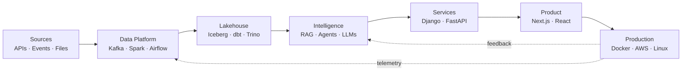

<!--
  Kousha Rezaei — GitHub Profile README
  The banner.svg file is expected to remain beside this README in the profile repository.
-->

<p align="center">
  
</p>

<p align="center">
  <a href="https://kousharezaei.dev">
    
  </a>
  <a href="https://www.linkedin.com/in/kousha-rezaei">
    
  </a>
  <a href="mailto:hello@kousharezaei.dev">
    
  </a>
  
</p>

<p align="center">
  
</p>

<h3 align="center">DATA &nbsp;→&nbsp; AI &nbsp;→&nbsp; PRODUCT</h3>

<p align="center">
  I build production systems across the stack — from distributed data pipelines and AI infrastructure<br />
  to secure APIs and interfaces people actually enjoy using.
</p>

<p align="center">
  <code>architecture</code>&nbsp;·&nbsp;<code>engineering</code>&nbsp;·&nbsp;<code>delivery</code>&nbsp;·&nbsp;<code>operations</code>
</p>

---

## `> whoami`

```python
class KoushaRezaei:
    location = "Portugal"
    disciplines = ("full-stack", "AI", "data engineering")

    def build(self):
        return "raw data → reliable systems → intelligent product"

    def engineering_style(self):
        return {
            "architecture": "clean",
            "security": "built in",
            "operations": "observable",
            "delivery": "production-ready",
        }
```

I started in **full-stack engineering** and kept going deeper: into distributed data systems, AI infrastructure, and production architecture.

Today I work across the boundaries between those disciplines. I can take a raw event or dataset, move and model it through a reliable pipeline, expose it through a secure service, add an LLM or agent layer, and build the product that sits on top.

**Fewer handoffs. Less context lost. One coherent system.**

> I like abstractions. I just prefer knowing what they are abstracting.

---

## `> engineering_map`

| Layer | What I build | Engineering focus |
|:--|:--|:--|
| **Data** | Batch and streaming pipelines, lakehouse platforms, transformation layers, analytics-ready datasets | Reliability, lineage, data quality, scalability |
| **Intelligence** | RAG systems, agents, tool use, memory, structured generation, model integrations | Grounding, evaluation, safety, useful behavior |
| **Backend** | APIs, application services, async workloads, auth, caching, persistence | Clear boundaries, security, performance, observability |
| **Product** | Responsive web applications and AI-native interfaces | Accessibility, speed, understandable UX, maintainability |
| **Platform** | Containers, cloud infrastructure, reverse proxies, CI/CD, Linux operations | Reproducibility, hardening, recovery, sane operational cost |



<p align="center">
  <sub>The boxes are the easy part. The arrows are where engineering happens.</sub>
</p>

---

## `> stack --grouped`

### Languages & application engineering

<p>
  
</p>

`REST APIs` · `Authentication` · `Async workloads` · `Caching` · `Responsive UI` · `Accessible interfaces`

### Data systems

<p>
  
  
  
  
  
  
  
</p>

`Lakehouse architecture` · `Bronze / Silver / Gold` · `Batch + streaming` · `ETL / ELT` · `Data modeling` · `Data quality`

### AI engineering

<p>
  
  
  
  
  
</p>

`Retrieval` · `Agents` · `Tool calling` · `Streaming` · `Memory` · `Structured outputs` · `Prompt engineering`

### Databases, infrastructure & security

<p>
  
</p>

`PostgreSQL` · `Redis` · `Docker` · `Kubernetes` · `AWS` · `Nginx` · `Linux` · `CI/CD` · `OWASP` · `System hardening`

> Somewhere in the system, inevitably, there is a YAML file.

---

## `> featured_work`

### AXION — a private AI assistant, built end to end

**AXION** is an ad-free AI product I designed, engineered, and shipped across the full stack: product interface, backend services, AI orchestration, persistence, and production infrastructure.

| Capability | Implementation focus |
|:--|:--|
| Streaming conversations | Responsive delivery of model output through the application stack |
| Web search and RAG | Retrieval and grounding for useful, context-aware responses |
| Tool and code execution | Controlled access to capabilities beyond text generation |
| Per-user memory | Persistent context tied to authenticated users |
| Product experience | Custom, animated interface built for focused interaction |
| Production delivery | Containerized services behind Nginx with PostgreSQL and Redis |

**Stack:** `Next.js` · `React` · `TypeScript` · `Django` · `PostgreSQL` · `Redis` · `Docker` · `Nginx`

> **No tracking. No ads. Just answers.**

[Explore AXION →](https://kousharezaei.dev)

<br />

### Lakehouse & data platform engineering

Designing systems that turn raw events into reliable, queryable, analytics-ready information.

```text
Sources        Ingestion         Lakehouse layers                  Consumers
────────       ─────────         ────────────────                  ─────────
APIs      ┐                    ┌────────┐   ┌────────┐   ┌──────┐
Events    ├──▶ Kafka / Batch ─▶│ BRONZE │──▶│ SILVER │──▶│ GOLD │──▶ BI / APIs / AI
Files     ┘                    │  raw   │   │ clean  │   │ ready│
                              └────────┘   └────────┘   └──────┘
                                   Spark · Iceberg · dbt · Trino
```

**Engineering focus:** distributed processing, batch and streaming ingestion, orchestration, transformation, query performance, data quality, and analytics serving.

**Stack:** `Spark` · `Kafka` · `Airflow` · `Iceberg` · `Trino` · `ClickHouse` · `dbt`

<br />

### Security-minded engineering

I also spend time breaking things — **with permission**.

Security research shapes how I build: threat modeling, authentication, authorization, secrets management, attack-surface reduction, OWASP awareness, and infrastructure hardening are architecture concerns, not release-week decorations.

---

## `> cat engineering-principles.md`

| Principle | In practice |
|:--|:--|
| **Production over demos** | Failure modes, recovery, and operational reality matter before launch. |
| **Security by design** | Identity, permissions, secrets, and attack surface belong in the architecture. |
| **Observability is a feature** | Logs, metrics, and useful diagnostics are part of a system's interface. |
| **Abstractions are earned** | Understand the underlying system before hiding its complexity. |
| **Reliability beats novelty** | Use the simplest architecture that meets the actual requirements. |
| **Ownership crosses layers** | The work is not finished when a ticket moves columns; it is finished when the outcome works. |

```diff
+ Reproducible deployments
+ Useful documentation
+ Tests around meaningful risk
+ Boring reliability
+ Reading the logs

- "Works on my machine"
- Distributed systems for problems one process can solve
- TODO: add security later
```

---

## `> operating_mode`

```yaml
engineering:
  architecture: clean
  security: first_class
  abstractions: earned
  systems: observable
  deployments: reproducible

preferences:
  simple_before_distributed: true
  production_before_theatre: true
  curiosity: high
  tolerance_for_mystery_bugs: low
  coffee_dependency: under_investigation
```

---

## `> connect`

I am interested in ambitious engineering work where **data, intelligent systems, and real products meet** — especially remote roles and collaborations across full-stack, AI, and data engineering.

<p align="center">
  <a href="https://kousharezaei.dev">
    
  </a>
  <a href="https://www.linkedin.com/in/kousha-rezaei">
    
  </a>
  <a href="mailto:hello@kousharezaei.dev">
    
  </a>
</p>

<p align="center">
  <code>raw data</code>&nbsp;→&nbsp;<code>reliable systems</code>&nbsp;→&nbsp;<code>intelligence</code>&nbsp;→&nbsp;<code>product</code>
</p>

<p align="center">
  <strong>Build the whole system. Understand the trade-offs. Ship it properly.</strong>
</p>
