<!--
  Kousha Rezaei — GitHub Profile README
  Profile repo: Koi725/Koi725
-->

<p align="center">
  
</p>

<h1 align="center">Platform & Data Engineer</h1>

<p align="center">
  <strong>Secure data platforms · Reliable pipelines · Distributed infrastructure</strong>
</p>

<p align="center">
  I build data systems end to end — from identity and secure access<br/>
  to ingestion, orchestration, storage, APIs, and production infrastructure.
</p>

<p align="center">
  <a href="https://kousharezaei.dev">
    
  </a>
  <a href="https://github.com/Koi725">
    
  </a>
</p>

<p align="center">
  
  
  
  
</p>

---

## 👨‍💻 What I do

My core work is **Platform & Data Engineering**, especially systems where data infrastructure and security meet.

### 🔐 Secure data-access platforms

I build services that securely expose protected data using:

- **SSO / OIDC authentication**
- **Role-based access control**
- **CyberArk secrets & certificate retrieval**
- **Secure S3 / object-storage access**
- **FastAPI service layers**
- **Containerized production deployments**

```text
User
  ↓
SSO / OIDC
  ↓
RBAC / Claims
  ↓
CyberArk
  ↓
Secure Data Access
  ↓
S3 / Query Layer
```

### 🌊 Data pipelines & lakehouse architecture

I build and maintain:

- Apache Airflow pipelines
- Dynamic DAG generation
- Mounted-folder ingestion
- Validation workflows
- S3-compatible sinks
- Medallion architecture
- Data-lineage migrations

```text
Sources → Airflow → Bronze → Silver → Gold → APIs / Analytics / AI
```

### ⚙️ Distributed platforms

I also build the infrastructure underneath those systems:

- HA **Docker Swarm** clusters
- Manager + worker node topology
- NFS shared storage
- Container failover
- Linux environments
- Deployment scripts & YAML configuration

> I care about the whole path: **identity → data → platform → production**.

---

## 🧠 Engineering focus

| Area | What I work on |
|---|---|
| **Data Platform** | Ingestion, orchestration, lakehouse, lineage, query layers |
| **Security** | OIDC, RBAC, secrets, certificates, hardening |
| **Backend** | APIs, services, persistence, caching |
| **Infrastructure** | Containers, clustering, storage, deployment |
| **AI** | LLM APIs, RAG, agents, tool use |
| **Product** | Full-stack applications and AI interfaces |

---

# 🧱 Tech Stack

## 🌊 Data Engineering & Platform

<p>
  
  
  
  
  
  
  
  
</p>

`ETL / ELT` · `Batch` · `Streaming` · `Dynamic DAGs` · `Medallion Architecture` · `Data Lineage`

---

## 🤖 AI Engineering

<p>
  
  
  
  
  
</p>

`LLM APIs` · `RAG` · `Agents` · `Tool Use` · `Structured Outputs`

---

## 🐍 Backend

<p>
  
  
  
  
  
</p>

`REST APIs` · `Authentication` · `Authorization` · `Caching` · `Service Architecture`

---

## ⚛️ Frontend

<p>
  
  
  
</p>

`Next.js` · `React` · `TypeScript` · `Responsive Interfaces`

---

## ☁️ Cloud / DevOps

<p>
  
  
  
  
  
  
</p>

`Docker` · `Swarm` · `Kubernetes` · `AWS` · `NFS` · `Nginx` · `Linux`

---

## 🛡️ Security

<p>
  
  
  
  
</p>

`SSO` · `OIDC` · `RBAC` · `CyberArk` · `OWASP` · `Pen Testing` · `Hardening`

---

# 🚀 Flagship Project — AXION

<p>
  <a href="https://kousharezaei.dev">
    
  </a>
</p>

**AXION** is my AI SaaS and the project where my broader engineering stack comes together.

I designed and built it across:

- Product interface
- Backend services
- AI orchestration
- LLM APIs
- RAG
- Agents & tool use
- PostgreSQL / Redis
- Containerized production infrastructure

**Stack**

`Next.js` · `React` · `TypeScript` · `Django` · `PostgreSQL` · `Redis` · `Docker` · `Nginx`

### [Explore AXION →](https://kousharezaei.dev)

---

## 🧭 How I think about engineering

```diff
+ Secure by design
+ Clear system boundaries
+ Reproducible deployments
+ Understandable data lineage
+ Useful failure handling
+ Infrastructure that survives restarts
+ Simple before distributed

- "We'll add security later"
- Copy-pasted pipelines
- Mystery data transformations
- Distributed systems for no reason
- Works on my machine
```

---

## ⚡ The short version

```text
Platform & Data Engineer

I build:

🔐 Secure data access
🌊 Reliable pipelines
🧱 Lakehouse platforms
⚙️ Distributed infrastructure
🐍 Backend services
🤖 AI-enabled products
```

<p align="center">
  <strong>Build the platform. Protect the data. Ship the system.</strong>
</p>

<p align="center">
  <a href="https://kousharezaei.dev">
    
  </a>
  <a href="https://github.com/Koi725">
    
  </a>
</p>
